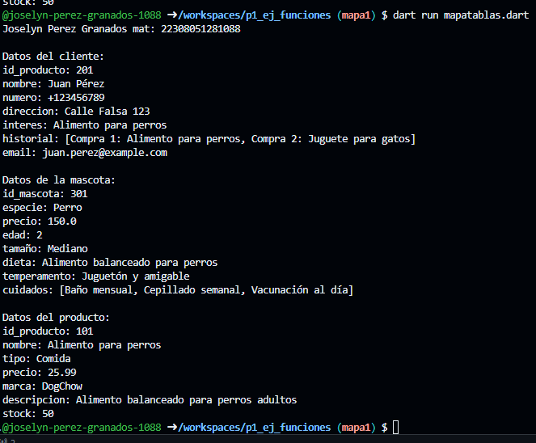

crear map <string, dynamic> tienda de mascotas tabla mascotas con los siguientes  key, id_mascota, especie, precio, edad, tamaño, dieta, temperamento y cuidados

crear map <string, dynamic> tienda de mascotas tabla clientes con los siguientes  key, id_producto, nombre, numero, direccion, interes, historial, email

crear map <string, dynamic> tienda de mascotas tabla mascotas con los siguientes  key, id_producto, nombre,tipo,precio,marca,descripcion,stock

ejemplo de salida

